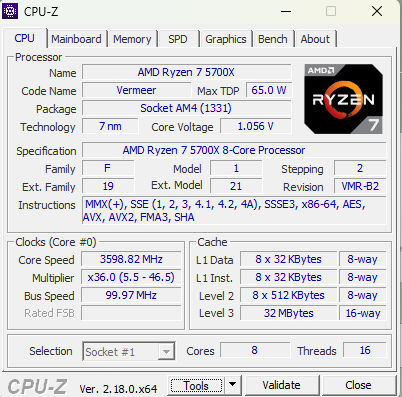
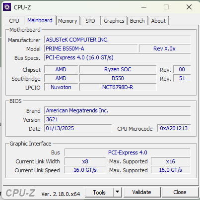
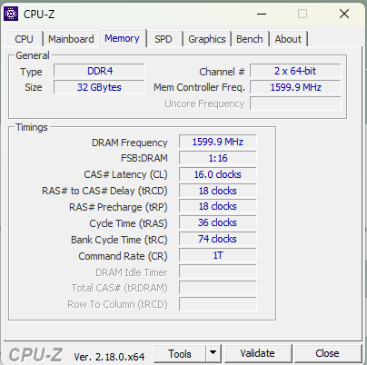
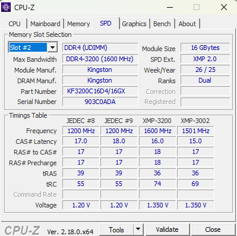
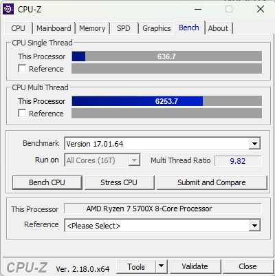
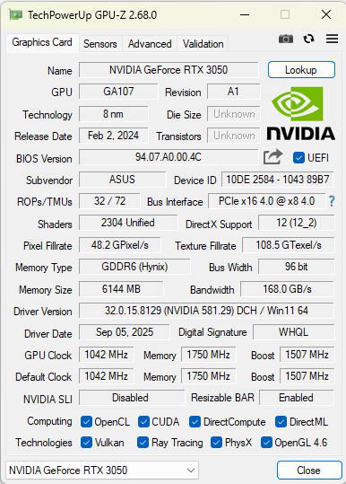
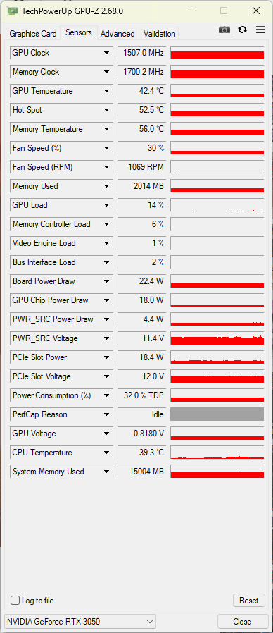
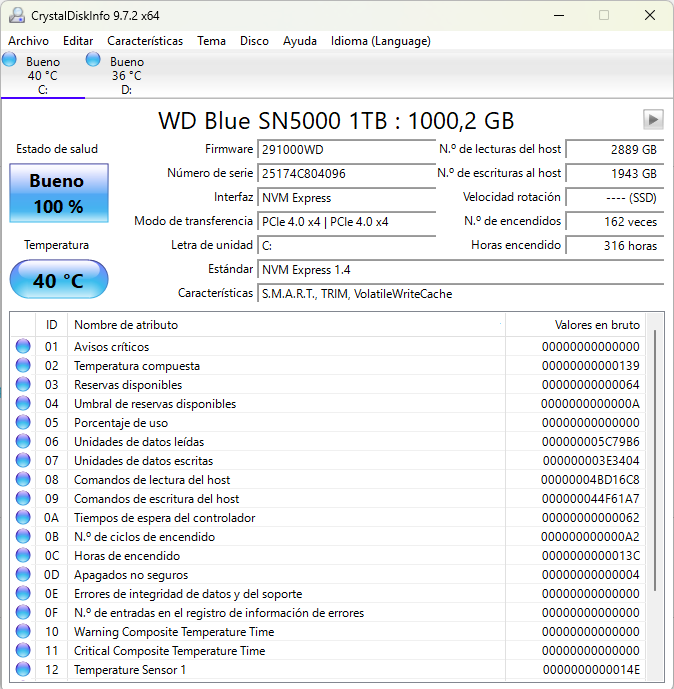
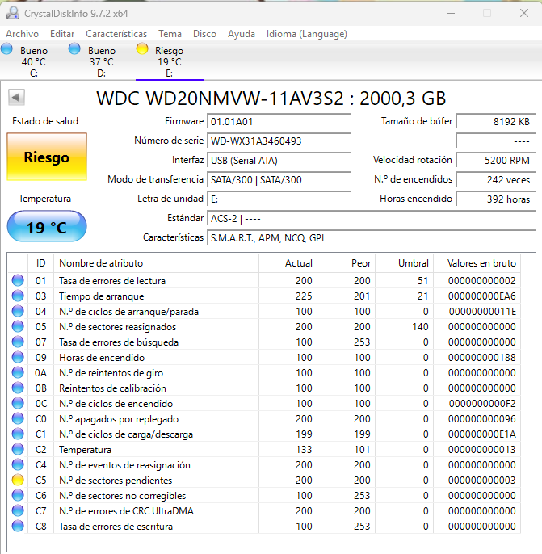

# Contenidos
 1. [Introducción](#introducción)
 2. [Cpu-z](#cpu-z)
 3. [Gpu-z](#gpu-z)
 4. [Crystal disk info](#crystal-disk-info)

 # Introducción

 En este punto se van a utilizar diferentes herramientas que nos permiten obtener información de los diferentes componentes del ordenador. Por ejemplo, que GPU tenemos o el estado de los discos. Se van a trabajar con tres herramientas diferentes que tienen objetivos distintos, estas son:

 **Cpu-z**: Esta herramienta nos muestra información del procesador y de la Ram a parte de otros componentes del ordenador. 
 **Gpu-Z**: Es como la primera herramienta (CPU-Z) pero dedicada a la tarjeta gráfica (GPU). 
 **Cistal Disk Info**: Esta herramienta se centra en el análisis de los discos y nos muestra la salud de estos. 

 # Cpu-z

Esta herramienta gratuita nos permite ver información detallada del procesador (CPU). Sirve para ver el modelo exacto de procesador que tiene el ordenador y todas sus características, como el núcleo y sus hilos, frecuencia actual y máxima (clock), las caches o su arquitectura. También nos da información de la placa base y de la RAM.

Tiene las siguientes pestañas: 
**CPU**: datos del procesador  
**Caches**: datos de la memoria caché 
**Mainboard**: datos sobre la placa base y la BIOS 
**Memory**: datos de la RAM y su uso real. 
**SPD**: Datos de cala modulo de la RAM. 

A continuación vamos a ver algún ejemplo de estas:

***Captura de la pestaña de CPU de CPU-Z*** 

En la imagen de arriba se puede observar que en este caso, mi ordenador tiene un AMD Ryzen 7 en concreto el modelo 5700X: en la parte inferior se ven además la velocidad de los núcleos en *Clocks (Core #0)* y el número de núcleos e hilos. En este caso de 8 núcleos y 16 hilos.

***Captura de la pestaña de Mainboard de CPU-Z*** 

En esta imagen se puede ver que mi placa base es una ASUSTeK COMPUTER INC. su modelo y que tiene PCI-Express 4.0. También se puede ver información de la BIOS.

***Captura de la pestaña de Memory de CPU-Z*** 

***Captura de la pestaña de SPD de CPU-Z***  

En la pestaña Memory se puede observar mi RAM, una DDR.4 de 32Gb, y en la SPD se ve cada módulo, siendo cada una de 16Gb y de la marca Kingston.

Por último, quiero señalar una utilidad que tiene para comprobar los componentes. En la pestaña Bench se puede hacer un Benchmark de los de la CPU. Abajo adjunto una imagen del proceso.

***Captura de la pestaña de Bench de CPU-Z*** 

También tiene una opción para ver la GPU pero no lo he puesto ya que hay una herramienta específica para ello.

 # Gpu-z

Este programa, al igual que CPU-Z en la CPU, nos da información específica de la GPU, es decir, la tarjeta gráfica. Nos muestra datos como el modelo exacto, la memoria gráfica (VRAM), el tipo, su frecuencia, su temperatura o el uso de la GPU. La primera pestaña, la de *Graphics Card* nos muestra que gráfica es, en este caso: una Nvidia GeForce RTX 3050 de ASUS. Con conexiones PCIe 4.0.

***Captura de la pestaña de Graphics Card de GPU-Z*** 

En la pestaña *sensors*, nos indica a tiempo real la velocidad del núcleo y de la VRAM de la GPU, su porcentaje de uso y su temperatura.

***Captura de la pestaña de sensors de GPU-Z*** 

Hay otra pestaña, la de advanced que nos muestra información de los monitores entre otros.

 # Crystal disk info
 
 Este programa nos ofrece una herramienta para ver el estado de salud de los discos. Anticipa los fallos y errores antes de que el disco muera. Se ve como un semáforo:
 **verde**-> disco sano
 **amarillo**-> precaución, el disco empieza a fallar.
 **rojo**-> malo, fallos serios.
 A continuación muestro dos imágenes diferentes con un disco nuevo que funciona correctamente y otro que está dando fallos. 
 
 ***Captura de diagnóstico de un disco en perfecto estado***
 
 ***Captura de diagnóstico de un disco en dañado***

 # Conclusión

 Como se ha visto, estos programas, nos ofrecen herramientas para comprobar la salud de nuestro ordenador. También para ver que componentes específicos lo componen.

