# Índice
1.[Introudcción](#introducción)
2.[Preparación del laboratorio](#preparación-del-laboratorio)
3.[Preparación de los discos](#preparación-de-los-discos)
4.[Creación del RAID](#creación-del-raid)
5.[Preparar el RAID para su uso](#preparar-el-raid-para-su-uso)
6.[Pruebas de funcionamiento](#pruebas-de-funcionamiento)
7.[Conclusión](#conclusión) Tengo que añadir conclusión

# Introducción


En esta práctica se va a realizar un RAID 6 con un sistema linux. En este caso, he utilizado un ubuntu server, ya que todo se va a realizar con la terminal y no se va a necesitar interfaz gráfica.
El RAID (Redundant Array of Independent/Inexpensive Disks) es una forma de almacenar los datos en varios discos duros a la vez. Su acceso es más rápido, evita la pérdida de información mediante la redundancia y combina varios discos duros en uno solo lógico más grande.
Hay varios tipos. En este laboratorio se va a realizar un RAID 6 con 6 discos para que haya siempre uno de repuesto y que no nos falle nada.
Para un RAID 6 al menos hacen falta 4 discos. Al tener dos bloques de paridad soporta que fallen dos discos al mismo tiempo sin que se pierda información. A continuación se muestra una tabla de como funciona.


| Disco 1 | Disco 2   | Disco 3 | Disco 4   |
| ------- | --------- | ------- | --------- |
| Datos A | Datos B   | Datos C | Paridad 1 |
| Datos D | Paridad 2 | Datos E | Datos F   |


Sus ventajas son:
- Es muy seguro ya que permite que fallen dos discos.
- Buena opción para almacenamiento grande.


Sus desventajas:
- Requiere 4 discos de los que se pierde parte de la capacidad por tener paridad en dos discos.
- La velocidad de escritura es más lenta que en el RAID 5 al calcular 2 paridades.


# Preparación del laboratorio


A la máquina virtual, en este caso con un SO Ubuntu server, se van a añadir 6 discos duros. Como es para una práctica, estos son todos de 1 Gb.
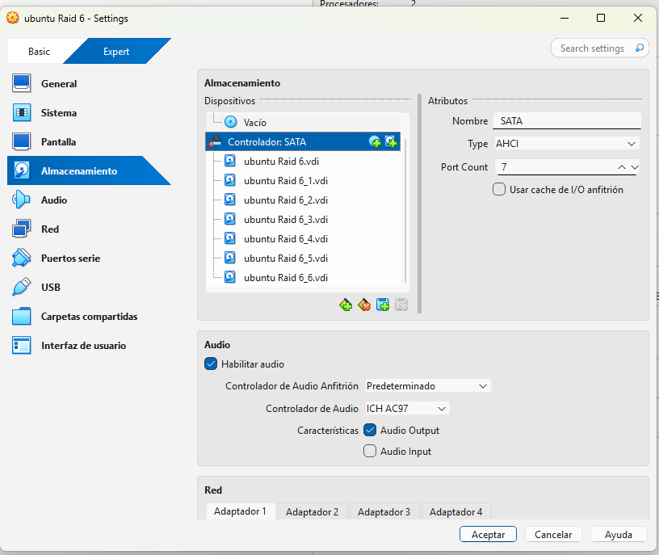


# Preparación de los discos
En este caso vamos a preparar los discos duros que hemos introducido para que el SO pueda trabajar sobre ellos y hacer el Raid. Para ello, se tienen que crear una partición en ellos y cambiar esta a tipo Linux raid.
En primer lugar se va a ver todos los discos físicos y el estado de las particiones lógicas con el siguiente comando.
```
lsblk
```
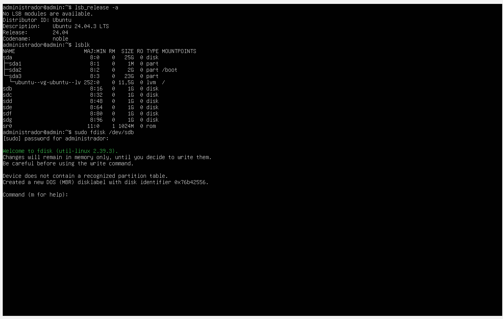
Se va a realizar la configuración sobre un disco, que luego se van a copiar en los siguientes. Para crear la partición se van a escribir los siguientes comandos en el siguiente orden:
```
sudo fdisk /dev/sbd
    m //comando de ayuda
    n //comando para crear partición. Tras esto dejamos los valores por defecto con intro. Estos son:
   
    p //primaria
    1 // porque solo queremos una de partición
   


    l // comando para ver todos los tipos de particiones y ver el nombre de la partición para raid
    t // comando para cambiar tipo de partición a FD RAID
    fd  // Para poner el tipo Linux raid


    p // consultar el número y tipo de particiones existentes
    w // Guardar y salir
```
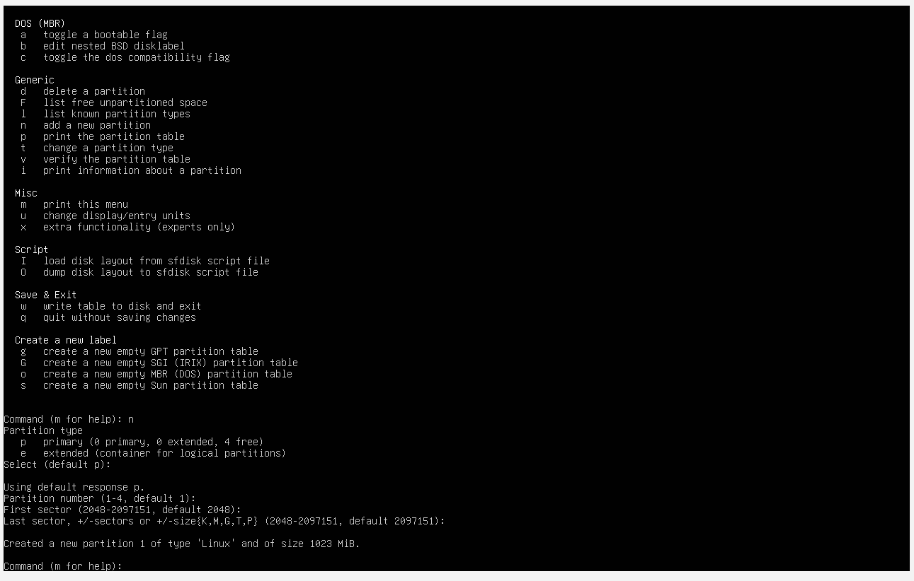
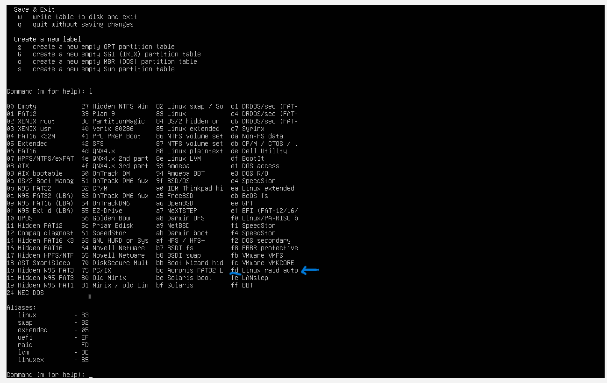
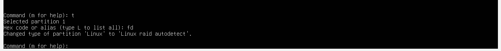
Ahora se va a copiar la configuración de disco sdb al resto de los discos. Para ello tenemos que situarnos en la raíz y poner los siguientes comandos:
```
sudo su //Para entrar en la raíz del sistema
sfdisk -d /dev/sdb | sfdisk /dev/sdc //copia particiones del disco sdb al sdc. para los siguientes discos en el sdc hay que poner el nombre del disco que queremos editar.
```
<figure>
    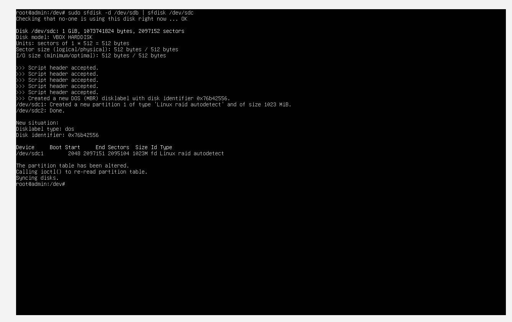
    <figcaption>Ejemplo de la copia de configuración en el disco sdd al sdc</figcaption>
</figure>


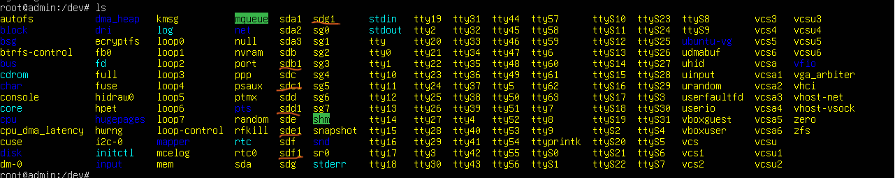


En esta última imagen se ve que los discos que hemos añadido del sdc al sdg están particionados como se puede ver como por ejemplo en el disco sdd1.


# Creación del RAID


Para la creación del RAID tenemos que ejecutar los comandos como administrador, es decir, en sudo. Para ello seguimos los siguientes comandos:
```
sudo apt-get update //buscar actualizaciones del sistema
sudo apt-get upgrate //Actualizar el sistema
sudo apt-get install mdadm //instalar el comando mdadm si no lo tenemos.
#comando de creación del raid
sudo mdadm --create --verbose /dev/md0 --level=6 --raid-device=5 /dev/sdb1 /dev/sdc1  /dev/sdd1 /dev/sde1 /dev/sdf1
```
El comando mdadm es que que se encarga de llevar a cabo el RAID. En el último comando le decimos al sistema que cree un solo volumen en raid 6 con 5 dispositivos y a continuación le damos la ruta de cada uno. Reservamos el sdg1 para utilizarlo posteriormente.
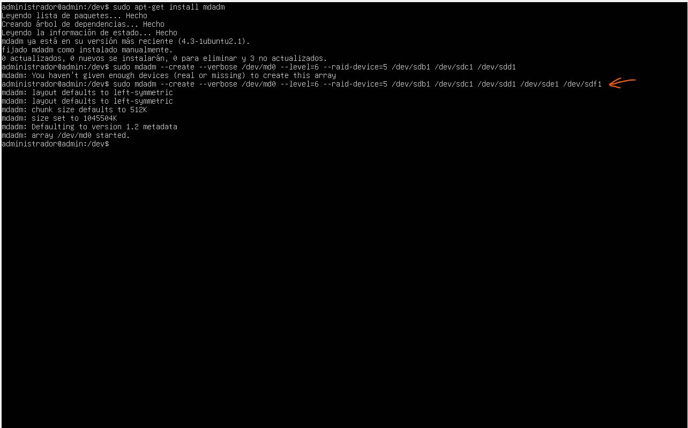


Otros comandos interesantes durante la creación del RAID son los siguientes:
```
# Comandos para consultar el estado de la creación
sudo cat /proc/mdstat
sudo watch -n1 sudo cat /proc/mdstat


sudo mdadm --detail /dev/md0 // para ver los detalles del RAID 6 nuevo
sudo mdadm -E /dev/sd[b-f]1 // para ver en detalle los discos
#sudo mdadm -E /dev/sd[aquí van el rango de los discos a consultar]1
```
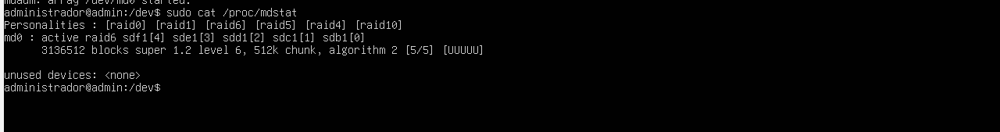
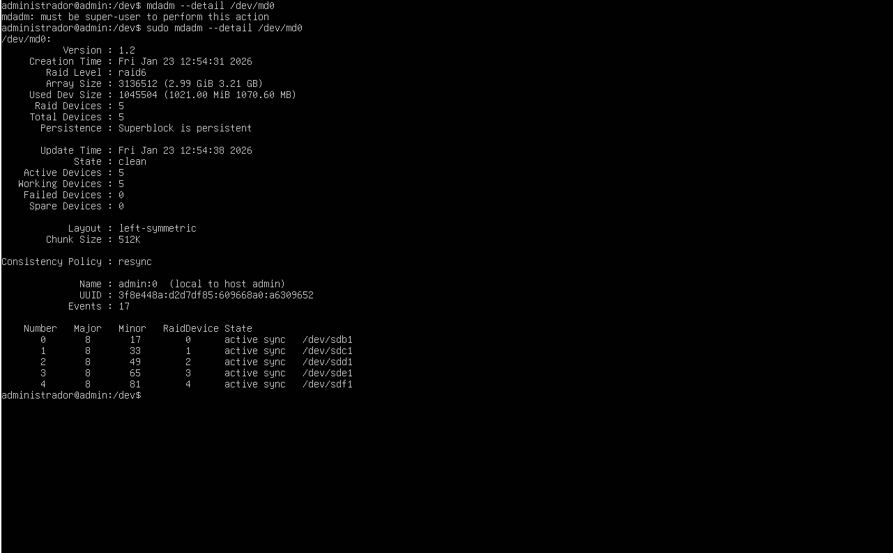
<figure>
    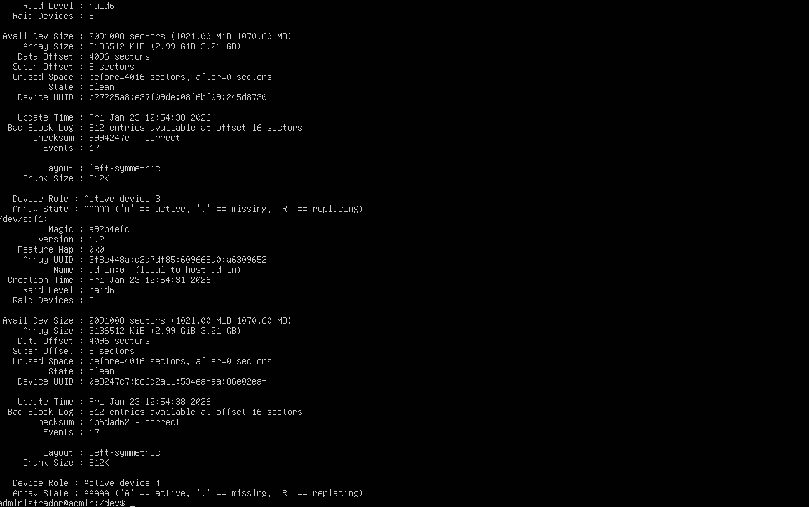
    <figcaption>Información de todos los discos que conforman el raid 6</figcaption>
</figure>


# Preparar el RAID para su uso


En este paso se va a dar formato al RAID 6 y se va a crear un directorio en el que se va a montar para que se pueda acceder al mismo. Para ello se van a ejecutar los comandos:
```
sudo mkfs.ext4 /dev/md0 // para dar el formato de partición y crear la partición del Raid6
sudo mkdir /mnt/Raid6 // para crear el directorio en Linux, desde el  mdaque podremos acceder al RAID6
sudo mount /dev/md0 /mnt/Raid6 // para montar la unidad de RAID6 y hacerla visible y utilizable
```
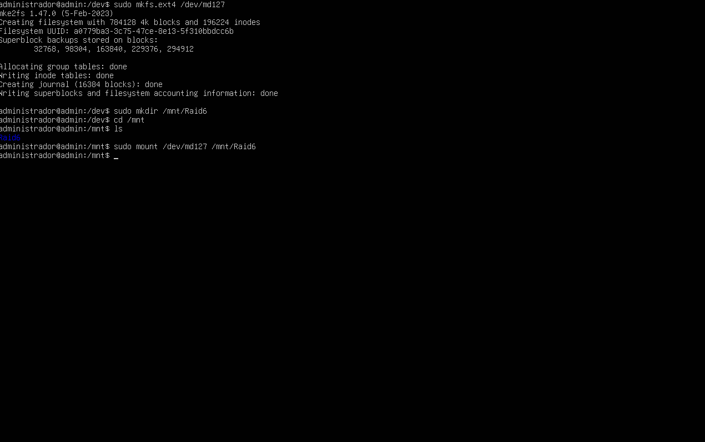
**El RAID se llama md127 ya que es el nombre por defecto que le dio el servidor al guardar la máquina**


Se va a comprobar además que se hayan creado bien los discos y particiones con:
```
sudo fdisk -l /dev/md0
df -h
```
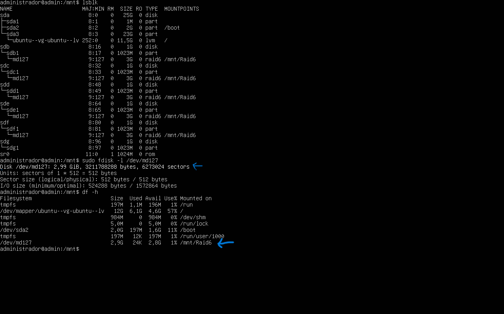
**Como se puede observar en la imagen con el comando lsblk se puede observar que del disco sdb al sdf sus particiones están usadas para el RAID con el md127 y en los siguientes comandos se puede ver el tamaño del RAID**


Ahora se va a comprobar que funciona correctamente creando un archivo en el directorio donde está ubicado el RAID. Para ello seguimos los siguientes comandos:
```
cd /mnt/Raid6 //para movernos al directorio donde esta el Raid6
ls -l //para ver lo que hay en el directorio
sudo touch montaje_RAID.txt //para crear el archivo
sudo nano montaje_RAID.txt //para editarlo
cat montaje_RAID.txt //para leer el fichero
```
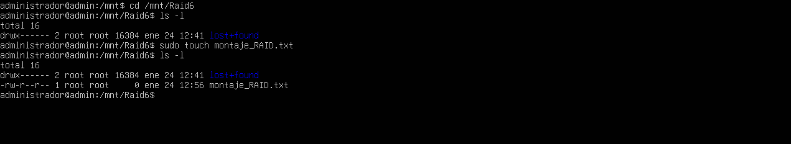

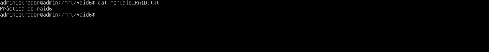
Por último se va a configurar RAID para que se monte bien al arrancar. Para ello se va a volcar la configuración y se va a actualizar. Los comando que se van a usar son:
```
sudo mdadm --detail --scan |sudo tee -a /etc/mdadm/mdadm.conf // Comando que vuelca la configuración al archivo mdadm.comf para guardar la configuración del raid
cat /etc/mdadm/mdadm.conf


sudo update-initramfs -u  // Actualiza la RAM de arranque para que el RAID se monte desde el inicio.


sudo nano /etc/fstab // abrimos ese archivo en modo edición y le introducimos el siguiente script
# añade la línea del RAID a /etc/fstab, para que se cargue de inicio
echo '/dev/md0 /mnt/Raid6 ext4 defaults,nofail,discard 0 0' |sudo tee -a /etc/fstab


lsblk
sudo mdadm --detail /dev/md0
```
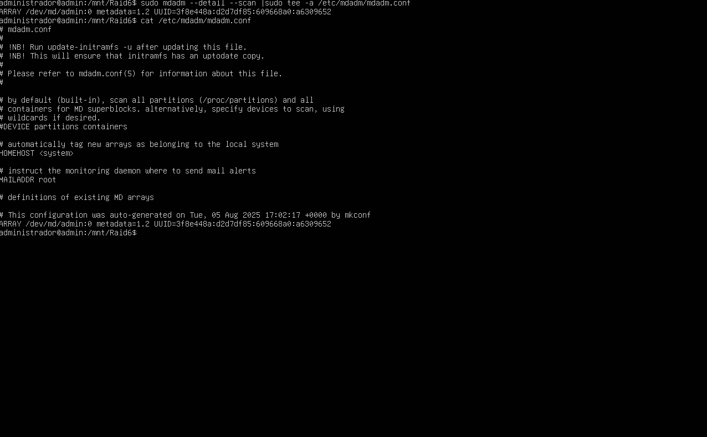
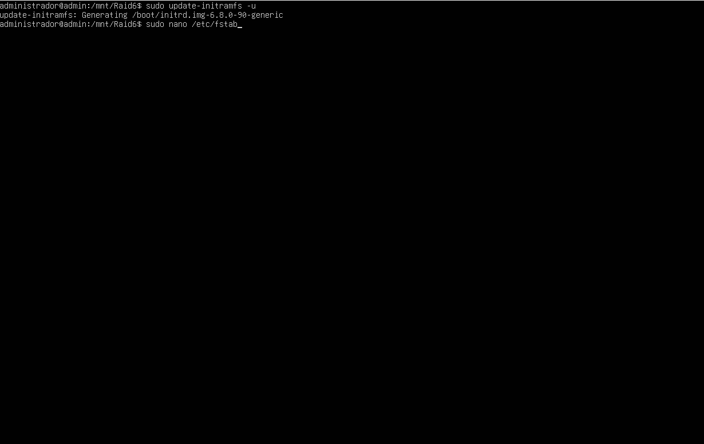
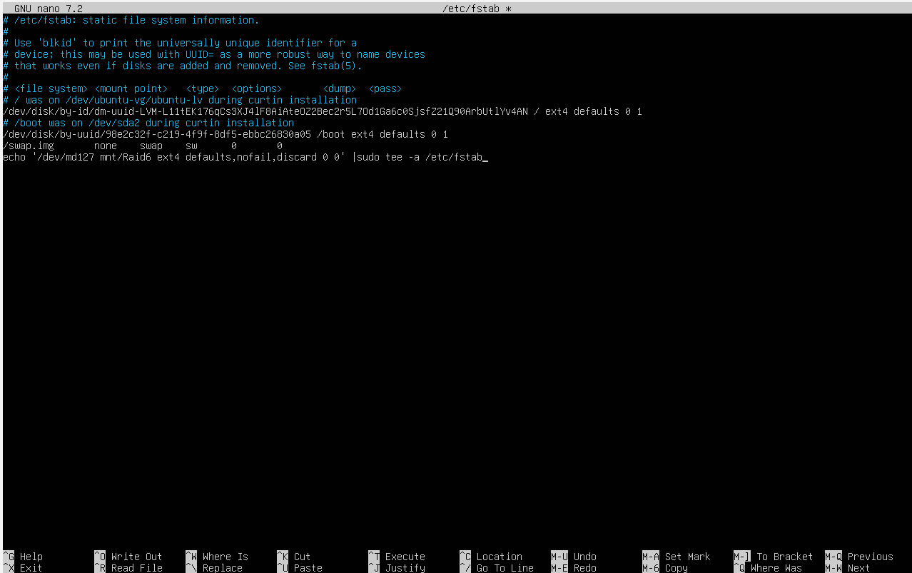
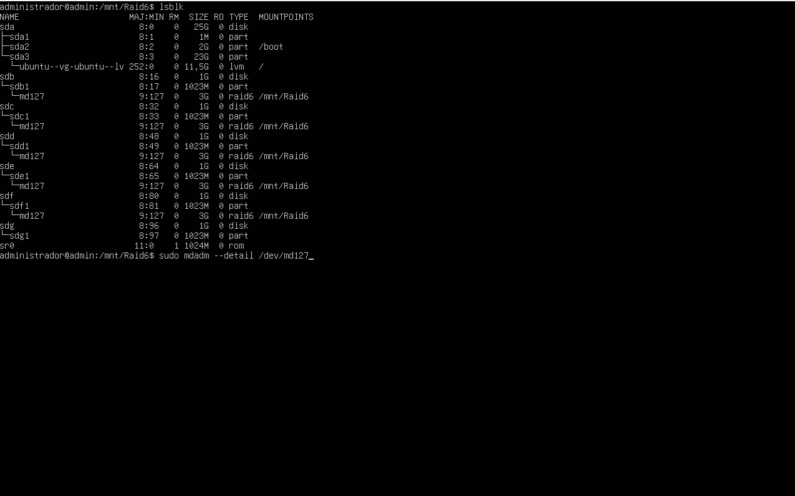
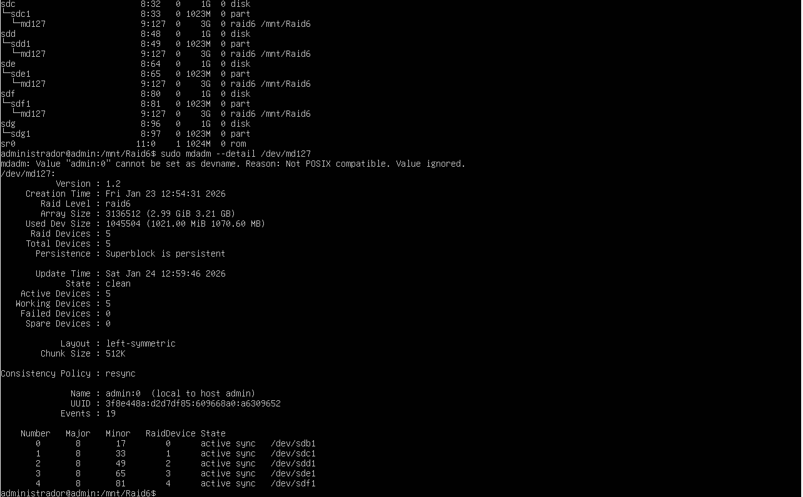


# Pruebas de funcionamiento


En este paso se va a utilizar el disco que se había dejado sin utilizar sdbg. Se va a utilizar para comprobar de que el RAID funciona correctamente aunque un disco falle y le cambiemos el disco utilizando el disco de reserva. Se van a seguir los siguientes comandos:
```
sudo mdadm --add /dev/md0 /dev/sdg1 // añadimos el último disco que nos quedaba pendiente al RAID6


sudo mdadm --detail /dev/md0


sudo mdadm --manage --fail /dev/md0 /dev/sdd1 // forzamos el fallo de un disco
sudo mdadm --detail /dev/md0


sudo mdadm --manage /dev/md0 --remove /dev/sdd1 // quitamos el disco fallido del RAID, para desconectarlo y poder arreglarlo
sudo mdadm --add /dev/md0 /dev/sdd1 // una vez arreglado o sustituido, volvemos a meter el disco para tener uno vacío
```

**En esta imagen se puede ver que el disco sdg1 está a la espera como repuesto**


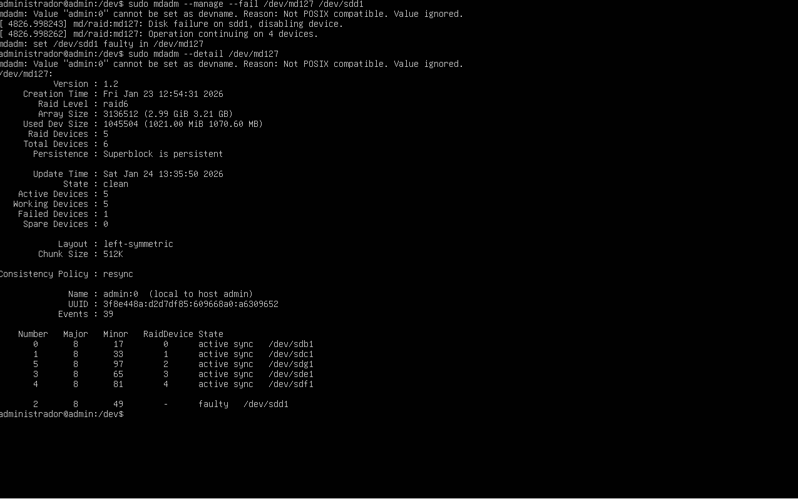
**El disco sdd1 está fallando y el sdg1 toma su lugar**


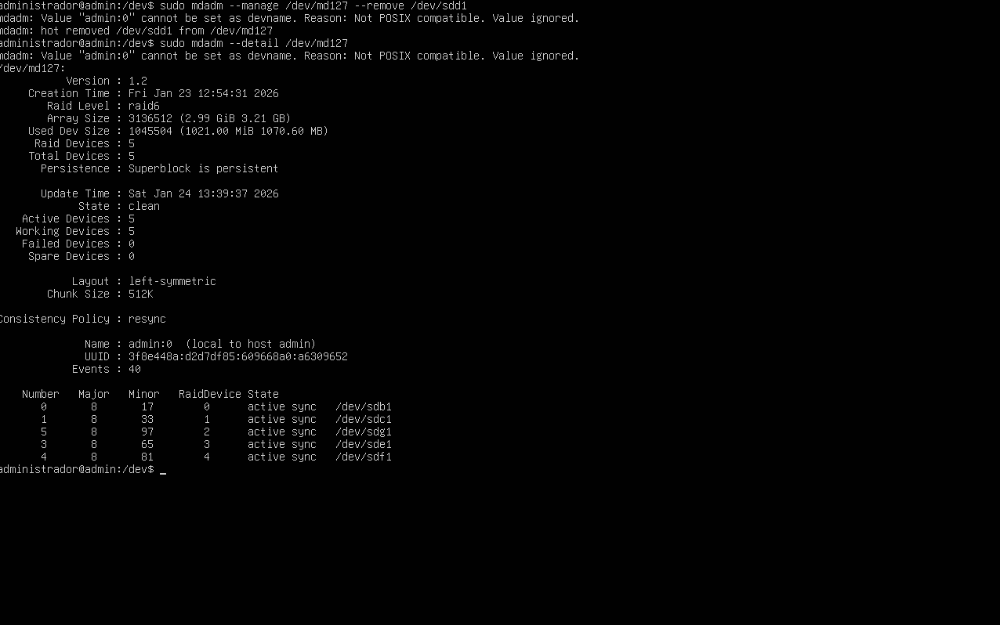
**Al eliminar el disco sdd1 ya no se muestra**


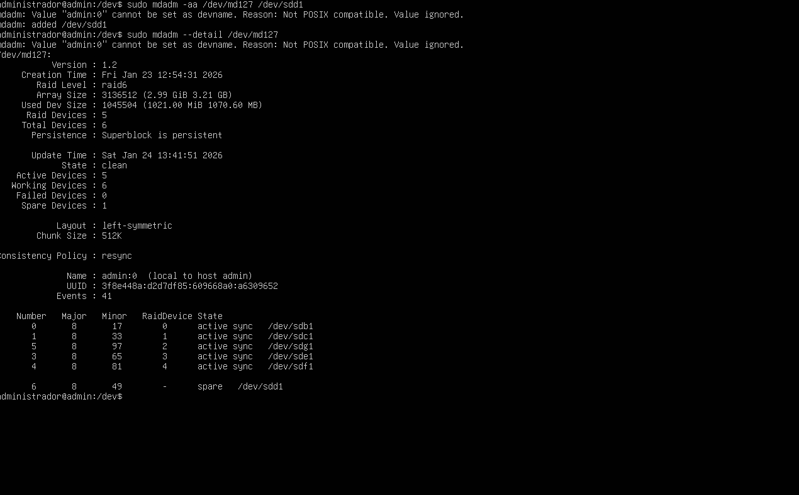
**Tras la reparación del disco se puede volver a añadir o a sustituir por uno nuevo quedando ahora este a la espera como repuesto**


# Conclusión
